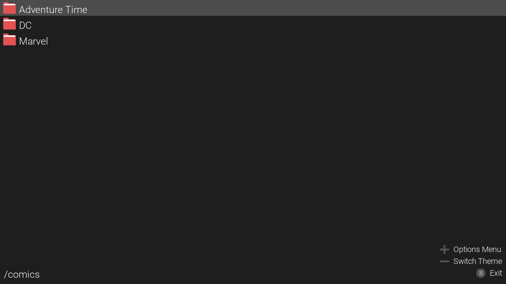
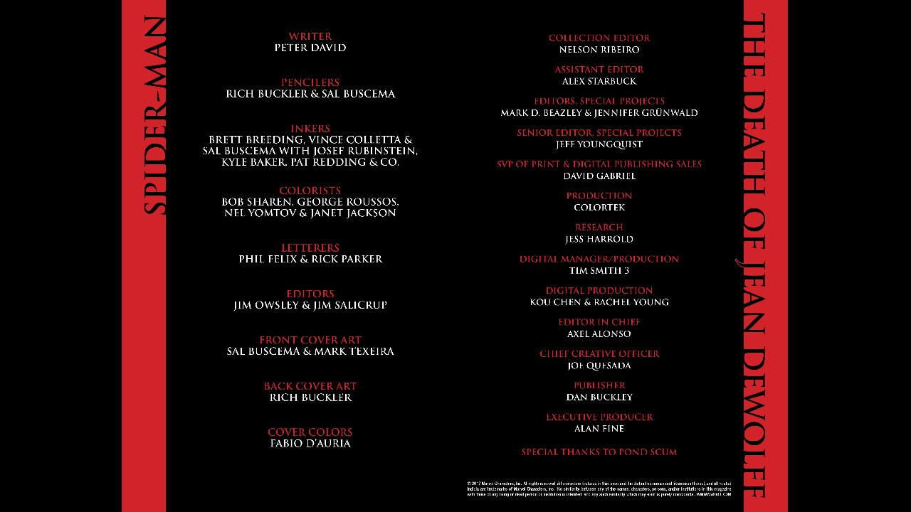
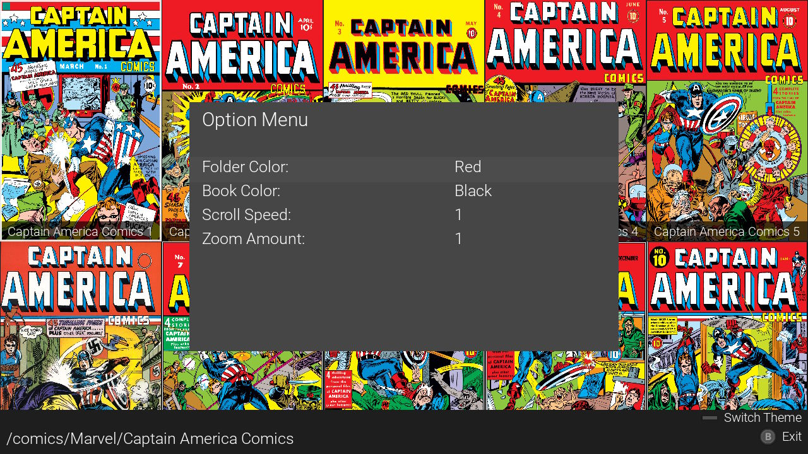
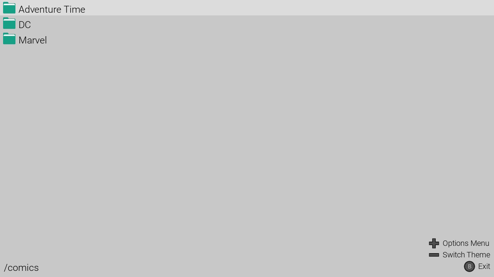
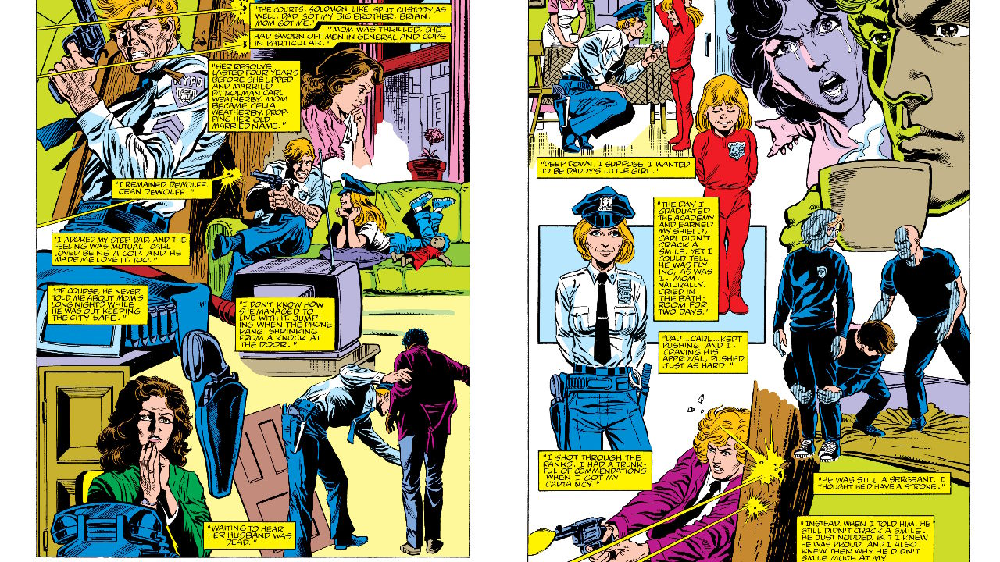

# WookReader

A comic and e-book reader for the Nintendo Switch.

Fork of eBookReaderSwitch with major improvements to performance, format support, and usability.

## Features

- **Format support:** PDF, EPUB, XPS, CBZ, CBR, CBT, CB7
- **Reading modes:** Portrait, Landscape, Vertical (fit-to-width), Spread (two-page comics)
- **Cover grid browser** with folder navigation and thumbnail previews
- **Recently Opened** virtual folder at root for quick access to the last 20 books
- **Async prefetch** — next/previous pages pre-rendered for instant page turns
- **Raw image LRU cache** — revisited pages load instantly
- **Early first-page display** — cover shown in ~0.5s while large archives enumerate in background
- **Page-name disk cache** — second+ open of any comic skips enumeration entirely
- **RAR3 fast enumeration** — header-only scan (~50ms for 500MB solid RAR)
- **Progressive navigation** — flip through pages while archive is still scanning
- **Analog stick scrolling** — full 360° proportional panning with left stick
- **Pinch-to-zoom** and right-stick zoom
- **Swipe gestures** — swipe to turn pages (direction matches current reading mode)
- **Screen navigation buttons** — on-screen previous/next overlays, auto-fade after 3 s
- **Pan locking** — panning disabled when page fits the screen (no blank-space dragging)
- **Notes per book** — attach freeform text notes to any book or comic
- **Dark and light mode**
- **Natural sort** — files sort as 1, 2, 11 (not 1, 11, 2)
- **Saves last page, orientation, and dark mode settings**
- **Sorted file browser** (folders first A-Z, files A-Z, case-insensitive)

## Installation

1. Copy `WookReader.nro` to `/switch/WookReader/` on the SD card
2. Put your comics and books in folders inside `/switch/WookReader/`

## Controls

### Navigation

| Input | Portrait / Vertical | Landscape |
|---|---|---|
| D-Pad Left / Right | Prev / Next page | Prev / Next page |
| D-Pad Up | Zoom max | Prev page |
| D-Pad Down | Zoom out | Next page |
| ZL / ZR | Prev / Next page | Zoom out / Zoom in |
| R+ZR / L+ZL | Skip 9 pages forward/back | Skip 9 pages forward/back |
| SR / SL (Joy-Con) | Skip 10 pages forward/back | Skip 10 pages forward/back |
| Right Stick Up/Down | Zoom in / out | Prev / Next page |

### View

| Input | Action |
|---|---|
| Left Stick | Analog scroll 360° (panning disabled when page fits screen) |
| Left / Right Stick click | Reset view (zoom + pan) |
| Y | Cycle layout: Portrait → Landscape → Vertical → Portrait |
| X | Toggle status bar |
| Minus | Toggle dark / light mode |

### Touch

| Gesture | Portrait / Vertical | Landscape |
|---|---|---|
| Drag (1 finger) | Scroll / pan | Scroll / pan |
| Pinch (2 fingers) | Zoom | Zoom |
| Swipe left/right (≥180 px) | Next / Prev page | — |
| Swipe up/down (≥180 px) | — | Prev / Next page |
| Tap left or right edge | Prev / Next page | — |
| Tap top or bottom edge | — | Prev / Next page |

> Screen navigation buttons (if enabled in Options) follow the same left/right ↔ top/bottom axis as the current layout.

### Other

| Input | Action |
|---|---|
| A | Go to page (number pad) |
| L | Open notes overlay for current book |
| A (notes open) | Edit note via on-screen keyboard |
| B | Exit notes overlay / exit reader |
| Plus | Toggle help overlay |

## Options

Open Options from the file browser with the **Plus** button.

| Option | Default | Description |
|---|---|---|
| Scroll Speed | — | Left-stick and D-pad scroll distance per tick |
| Zoom Amount | — | Zoom step for ZL/ZR and D-pad zoom actions |
| Dark Mode | Off | Invert page colours |
| Status Bar | On | Show page number and zoom level at bottom of screen |
| Screen Buttons | Off | On-screen previous/next buttons that fade after 3 s |

## Screenshots

Dark Mode Folders:



Dark Mode Reading:



Dark Mode Options:



Light Mode Folders:



Light Mode Reading:



## Building

Requires [devkitPro](https://devkitpro.org/) with devkitA64 and Switch portlibs:

```
pacman -S libnx switch-portlibs
```

Build:

```
bash build_cbz.sh
```

## Credits

- moronigranja — expanded file format support
- NX-Shell Team — original application code base
- Papirus Icon Theme — folder/file icon design inspiration
